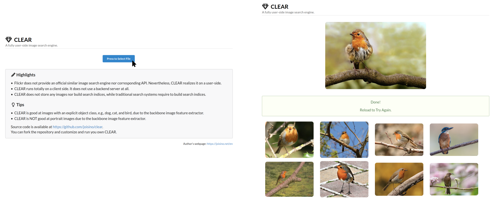

<h1 align="center">
  
</h1>
<p align="center">A fully user-side image search engine.</p>

## ✨ Highlights

* Flickr does not provide an official similar image search engine nor corresponding API. Nevertheless, CLEAR realizes it on a user-side.
* CLEAR runs totally on a client side. It does not use a backend server at all.
* CLEAR does not store any images nor build search indices, while traditional search systems require to build search indices.

## 📜 Paper

The paper describes CLEAR in detail.

arXiv: https://arxiv.org/abs/2206.08521

## 💻 Online Demo

https://clear.joisino.net/



Interface of CLEAR. Upload an image, and then CLEAR retrieves similar images from Flickr. The functionality of CLEAR is simple. The highlight lies rather in how it is realized and how easy the deployment is.

## 💿 Run your own CLEAR

```
$ git clone git@github.com:joisino/clear.git
$ cd clear
$ echo 'REACT_APP_FLICKR_KEY="0123456789abcdef"' > .env.local
$ npm install
$ npm start
```

Or you can try it with Docker.


```
$ git clone git@github.com:joisino/clear.git
$ cd clear
$ echo 'REACT_APP_FLICKR_KEY="0123456789abcdef"' > .env.local
$ docker run -it --rm -v $PWD:/app -p 13000:3000 -w /app -u node node /bin/bash -c "npm install && npm start"
```

Replace `0123456789abcdef` with a Flickr API key.
You can get a key at https://www.flickr.com/services/api/misc.api_keys.html. It takes a few minutes to get a key.

## 🛠️ Customize CLEAR

The feature extractor and score function are defined in `src/score.js`.

* `getFeature` computes feature vectors for both the source image and retrieved images. The embedding layer is defined in `embeddingName`. You can try other layers, e.g., `'module_apply_default/MobilenetV2/Logits/AvgPool'`.
* `embs2score` computes scores. The higher the better. You can try other functions, e.g., the Gaussian kernel `Math.exp(- emb1.squaredDifference(emb2).sum().dataSync()[0] / 1000)`.

As CLEAR does not rely on any backend servers or search indices, you can seamlessly use the system after you change the score function.

You can also change the search target from Flickr to other services by writing a wrapper in `src/flickr.js`.

## 🖋️ Citation

```
@inproceedings{sato2022clear,
  author    = {Ryoma Sato},
  title     = {CLEAR: A Fully User-side Image Search System},
  booktitle = {The 31st {ACM} International Conference on Information
               and Knowledge Management, {CIKM}},
  year      = {2022},
}
```
